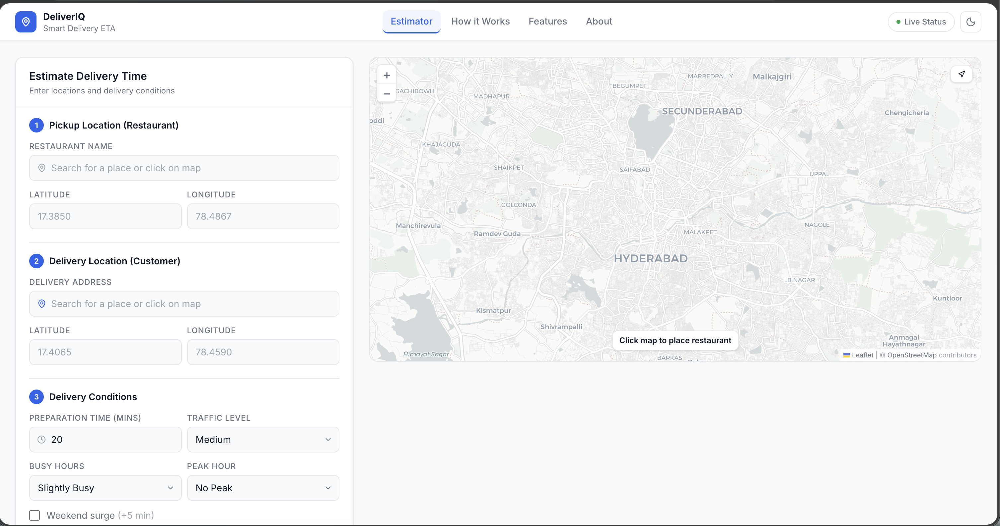
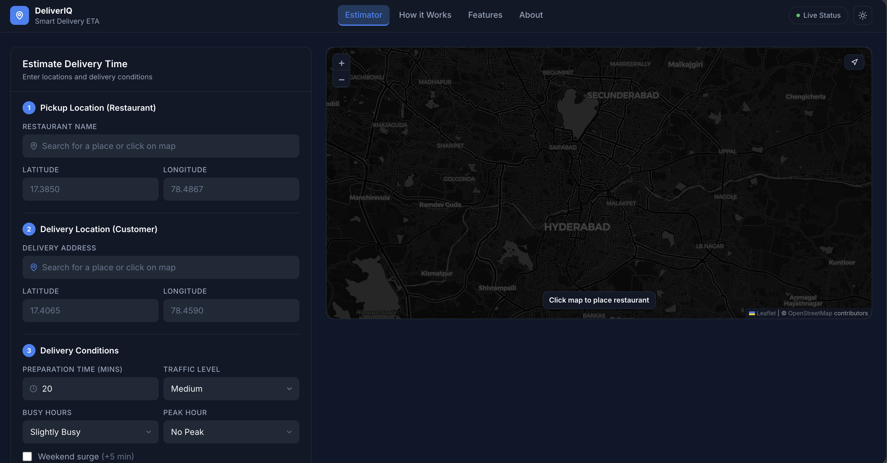

# DeliverIQ — Food Delivery ETA Estimator

> A full-stack delivery ETA estimation platform built with FastAPI and React, simulating real-world food delivery workflows with interactive map-based location selection, real-time weather integration, and Redis caching.


---

## Project Overview

DeliverIQ estimates food delivery arrival time by combining geospatial distance (Haversine formula) with real-world delivery variables — traffic multipliers, kitchen busy levels, peak hour dispatch delays, live weather conditions, and weekend surge pricing.

It is designed to reflect how internal tools at companies like Foodhub, Swiggy, and Uber Eats model delivery logistics at the engineering level.

---

## Features

- **Interactive Map** — Click OpenStreetMap to drop restaurant and customer pins. Drag to adjust. Route polyline drawn automatically.
- **Haversine Distance** — Accurate great-circle distance calculation between two GPS coordinates.
- **Dynamic Traffic Multipliers** — Low (1×), Medium (1.4×), High (2×) applied to base travel time.
- **Live Weather Integration** — Real-time weather fetched from OpenWeatherMap API. Sunny (+0m), Cloudy (+3m), Rain (+8m), Thunderstorm (+15m), Snow (+25m).
- **Redis Caching** — ETA results cached for 10 minutes by coordinate key. Cache hit/miss logged on every request.
- **Delivery Conditions** — Kitchen busy level, peak hour dispatch (Lunch/Dinner Rush), weekend surge delay.
- **Light & Dark Theme** — Full theme toggle persisted via localStorage.
- **ETA Dashboard** — Metric cards for distance, travel time, prep time, weather delay, and total ETA.
- **Status Card** — On Time / Moderate / Delayed classification with traffic, weather, and busy hours summary.
- **58 Tests** — Unit, integration, and boundary tests with mocked external dependencies.
- **Responsive** — Desktop-first layout with tablet and mobile support.

---

## Architecture

```
Browser (React + Vite)
        │
        │ HTTP (Axios)
        ▼
FastAPI Backend (Uvicorn)
        │
        ├── Haversine Utility   → Distance calculation
        ├── Weather Service     → OpenWeatherMap API (async, httpx)
        ├── Cache Service       → Redis (10-min TTL)
        └── ETA Service         → Orchestrates all services → Response
```

**ETA Calculation Formula:**

```
Total ETA = Base Travel Time
          + Traffic Delay (multiplier on travel time)
          + Preparation Time
          + Kitchen Busy Delay
          + Peak Hour Delay
          + Weather Delay
          + Weekend Surge
```

**Cache Key** — derived from restaurant lat/lon, delivery lat/lon, prep time, traffic level, busy level, peak hour, and weekend flag.

---

## Folder Structure

```
food-delivery-eta-estimator/
│
├── backend/
│   ├── app/
│   │   ├── core/
│   │   │   ├── config.py          # Pydantic settings, env vars
│   │   │   └── logging_config.py
│   │   ├── models/
│   │   │   └── estimate.py        # Request / Response Pydantic models
│   │   ├── routers/
│   │   │   └── estimate.py        # POST /api/estimate
│   │   ├── services/
│   │   │   ├── eta_service.py     # ETA orchestration (async)
│   │   │   ├── weather_service.py # OpenWeatherMap integration
│   │   │   └── cache_service.py   # Redis get/set
│   │   ├── utils/
│   │   │   └── haversine.py       # Great-circle distance
│   │   └── main.py                # FastAPI app entry point
│   ├── tests/
│   │   ├── conftest.py
│   │   ├── test_estimate_api.py   # Integration tests
│   │   ├── test_eta_service.py    # Unit tests (async, mocked)
│   │   └── test_haversine.py      # Utility unit tests
│   ├── Dockerfile
│   ├── docker-compose.yml
│   ├── requirements.txt
│   └── .env.example
│
└── frontend/
    ├── src/
    │   ├── components/
    │   │   ├── Navbar.jsx
    │   │   ├── ThemeToggle.jsx
    │   │   ├── SidebarForm.jsx
    │   │   ├── MapView.jsx
    │   │   ├── LocationMarker.jsx
    │   │   ├── RouteLine.jsx
    │   │   ├── MetricCard.jsx
    │   │   ├── StatusCard.jsx
    │   │   ├── ETADashboard.jsx
    │   │   ├── FeatureCard.jsx
    │   │   └── LoadingSkeleton.jsx
    │   ├── hooks/
    │   │   └── useTheme.js
    │   ├── pages/
    │   │   └── Home.jsx
    │   ├── services/
    │   │   └── api.js
    │   └── main.jsx
    ├── tailwind.config.js
    └── vite.config.js
```

---

## Screenshots

| Light Theme | Dark Theme |
|---|---|
|  |  |

---

## Installation

### Prerequisites

- Python 3.11+
- Node.js 18+
- Redis (local or via Docker)
- OpenWeatherMap API key — [Get one free](https://openweathermap.org/api)

### 1. Clone the repository

```bash
git clone https://github.com/DurgamPoojitha/food-delivery-eta-estimator.git
cd food-delivery-eta-estimator
```

---

## Running the Backend

### Option A — Docker (recommended)

```bash
cd backend
docker-compose up --build
```

This starts FastAPI on `http://localhost:8000` and Redis on `localhost:6379`.

### Option B — Local Python

```bash
cd backend

python -m venv venv
source venv/bin/activate          # Windows: venv\Scripts\activate

pip install -r requirements.txt
```

Create your `.env` file:

```bash
cp .env.example .env
```

Edit `.env`:

```env
ENVIRONMENT=development
CORS_ORIGINS=http://localhost:5173
LOG_LEVEL=INFO
LOG_FORMAT=text
WEATHER_API_KEY=your_openweathermap_api_key_here
```

Start the server:

```bash
uvicorn app.main:app --reload
```

API will be available at `http://localhost:8000`.  
Interactive docs at `http://localhost:8000/docs`.

### Running Tests

```bash
cd backend
source venv/bin/activate
pytest
```

Expected output: **58 passed**.

---

## Running the Frontend

```bash
cd frontend
npm install
npm run dev
```

Frontend will be available at `http://localhost:5173`.

> Ensure the backend is running on port 8000 before using the estimator.

---

## API Example

### `POST /api/estimate`

**Request:**

```json
{
  "restaurant_name": "Burger Palace",
  "restaurant_lat": 17.3850,
  "restaurant_lon": 78.4867,
  "delivery_lat": 17.4065,
  "delivery_lon": 78.4590,
  "prep_time": 20,
  "traffic": "medium",
  "busy_level": "high",
  "peak_hour": "dinner",
  "is_weekend": false
}
```

**Response:**

```json
{
  "restaurant_name": "Burger Palace",
  "distance_km": 12.4,
  "total_eta": 56.0,
  "delivery_status": "Moderate",
  "weather": "Light Rain",
  "weather_delay": 8.0,
  "eta_breakdown": {
    "base_travel_time": 18.6,
    "traffic_delay": 7.44,
    "base_prep_time": 20.0,
    "busy_delay": 10.0,
    "peak_delay": 12.0,
    "weather_delay": 8.0,
    "weekend_delay": 0.0
  }
}
```

**Status values:** `Fast Delivery` · `Moderate` · `Delayed`

**Traffic levels:** `low` · `medium` · `high`

**Peak hours:** `none` · `lunch` · `dinner`

---

## Environment Variables

| Variable | Description | Default |
|---|---|---|
| `ENVIRONMENT` | `development` / `production` | `development` |
| `CORS_ORIGINS` | Allowed frontend origins (comma-separated) | `http://localhost:5173` |
| `WEATHER_API_KEY` | OpenWeatherMap API key | — |
| `LOG_LEVEL` | `DEBUG` / `INFO` / `WARNING` | `INFO` |
| `LOG_FORMAT` | `text` (dev) / `json` (prod) | `text` |

---

## Technologies Used

| Category | Technology |
|---|---|
| Frontend | React 18, Vite, Tailwind CSS |
| Maps | React Leaflet, Leaflet.js, CartoDB / OpenStreetMap |
| Icons | Lucide React |
| HTTP Client | Axios |
| Backend | FastAPI, Uvicorn |
| Validation | Pydantic v2 |
| Distance | Haversine Formula |
| Weather | OpenWeatherMap API (httpx async) |
| Caching | Redis (redis-py, 10-min TTL) |
| Testing | pytest, pytest-asyncio, unittest.mock |
| Containerisation | Docker, docker-compose |

---

## Future Improvements

- [ ] Integrate a real routing API (OSRM or GraphHopper) for road-network distance instead of straight-line Haversine
- [ ] Add driver assignment simulation and live position tracking via WebSockets
- [ ] Historical ETA accuracy dashboard with PostgreSQL persistence
- [ ] User authentication and saved delivery profiles
- [ ] Multi-stop delivery routing with optimised stop ordering
- [ ] Prometheus metrics endpoint + Grafana dashboard for observability

---

## License

This project is licensed under the [MIT License](LICENSE).

---

> Built by [Durgam Poojitha](https://github.com/DurgamPoojitha) — Foodhub Engineering Portfolio Project
